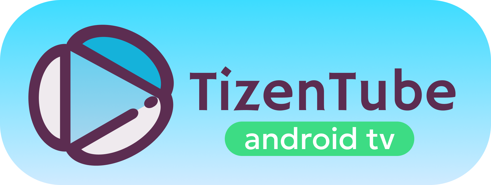

# 💠 TizenTube Cobalt

    
     

**TizenTube Cobalt** is an app based on [Cobalt](https://cobalt.dev) that enhances your favourite streaming website viewing experience by removing ads, adding [SponsorBlock](https://sponsor.ajay.app/) support, and providing useful features like video speed control.

<strong>What is Cobalt?</strong>

Cobalt is a lightweight, cross-platform application container and runtime for HTML5-based apps, originally developed by Google for embedded and resource-constrained devices (like smart TVs, set-top boxes, and game consoles). It implements a subset of the W3C HTML5 standard and runs web apps with high performance on a wide range of hardware.

## ✨ Features

- 🛑 **Ad Blocker**: Enjoy your favourite streaming website without interruptions from ads.
- ❗ **SponsorBlock Support**: Automatically skip sponsored segments in videos.
- ⏭️ **Video Speed Control**: Adjust playback speed to your preference.
- 🔺 **[DeArrow](https://dearrow.ajay.app/) Support**: Remove clickbait and misleading video titles.
- ➕ **More to come!** Request features via [issues](https://github.com/reisxd/TizenTube/issues/new).

## ⬇️ Download

Get the latest release for your platform:

[**Download Latest Release**](https://github.com/reisxd/TizenTubeCobalt/releases/latest)

AFTVNews code: `6366500`

For a better experience, preferably use TizenTube Cobalt on a [**Google TV certified device.**](https://www.androidtv-guide.com/)

## ❔ How to Install

1. Download the latest release from the link above.
2. Sideload or install the app on your device (using a file manager, ADB, or platform-specific method).
3. Open the app and enjoy an enhanced streaming experience!

## ℹ️ Community & Support

- [Discord Server](https://discord.gg/m2P7v8Y2qR)
- [Report Issues / Request Features](https://github.com/reisxd/TizenTube/issues)
